A list of statistics of the Wasabi Wallet's trustless CoinJoin implementation.

For a more deep explanation of every stats, including where to find the data and how to calculate them, give a look at the [Don't Trust, Verify](https://github.com/PulpCattel/Wasabi_Observatory/blob/master/Dont_Trust_Verify.md) section. 

---

## December

---

### GENERAL

#### CoinJoin per Day
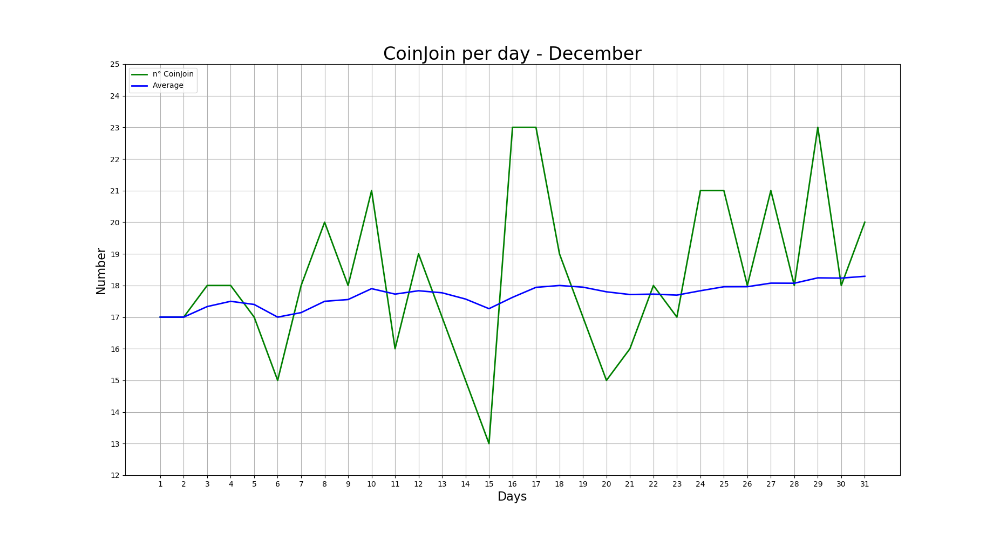

**Last values:**

* Blue line = 18.29

#### Partecipants per CoinJoin
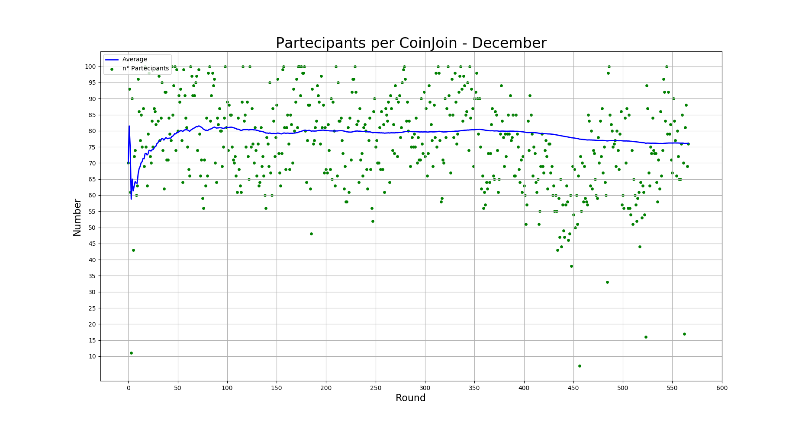

**Last values:**

* Blue line = 76.08

#### Average input size per CoinJoin
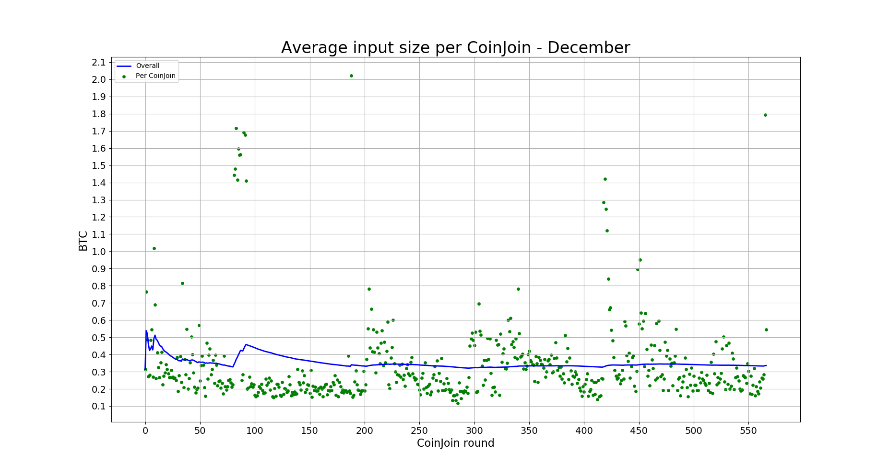

**Last values:**

* Blue line = 0.34

#### Total volume
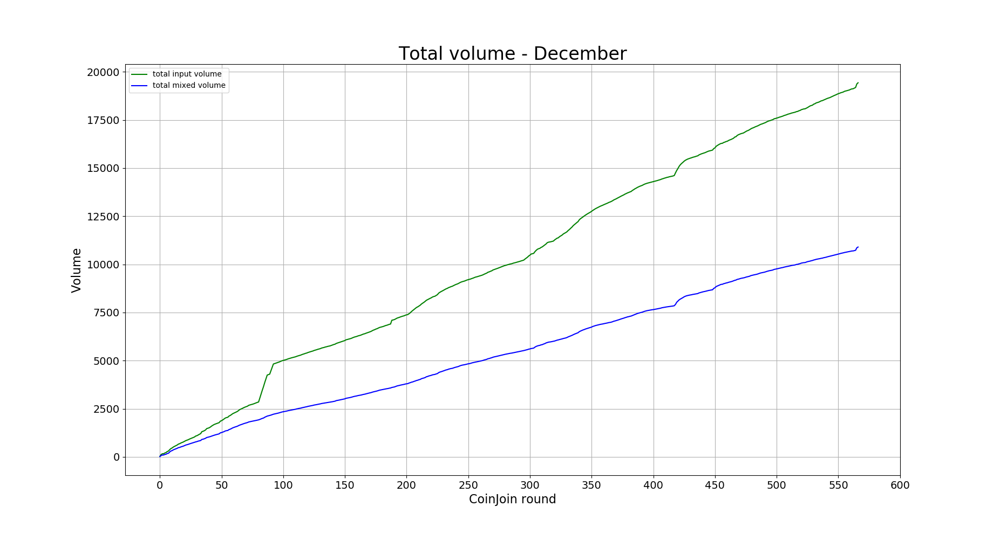

**Last values:**

* Green line = 19430.2
* Blue line = 10897.6

### INPUTS

#### Total number addresses/inputs
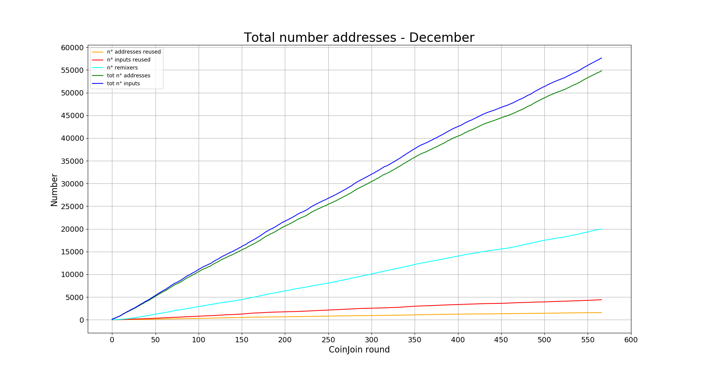

**Last values:**

* Orange line = 1596
* Red line = 4417
* Light blue line = 19977
* Green line = 54825
* Blue line = 57646

#### Percentage remixers per CoinJoin
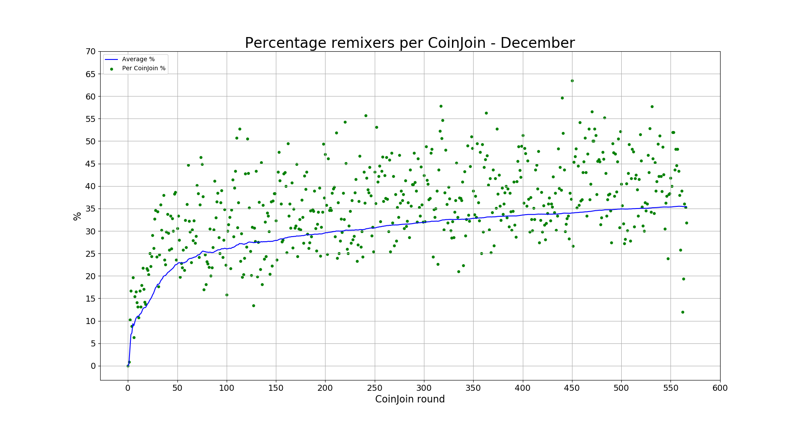

**Last values:**

* Blue line = 35.41

#### Total percentage remixers
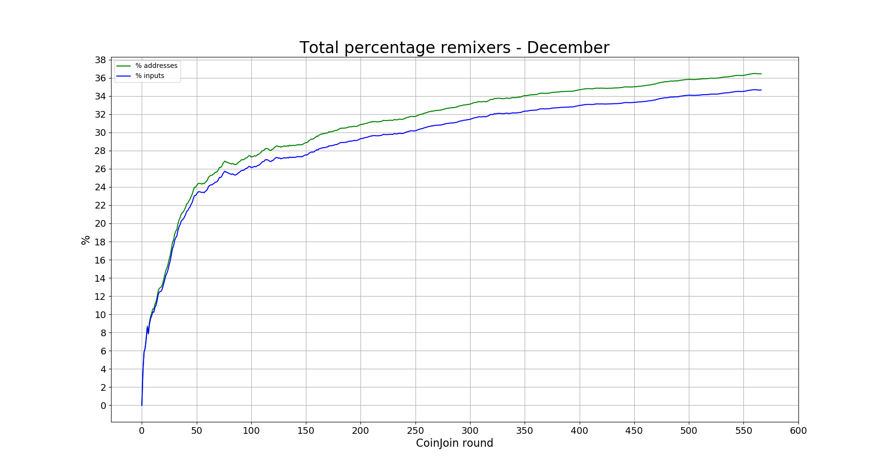

**Last values:**

* Green line = 36.44
* Blue line = 34.65

#### Percentage address reuse per CoinJoin
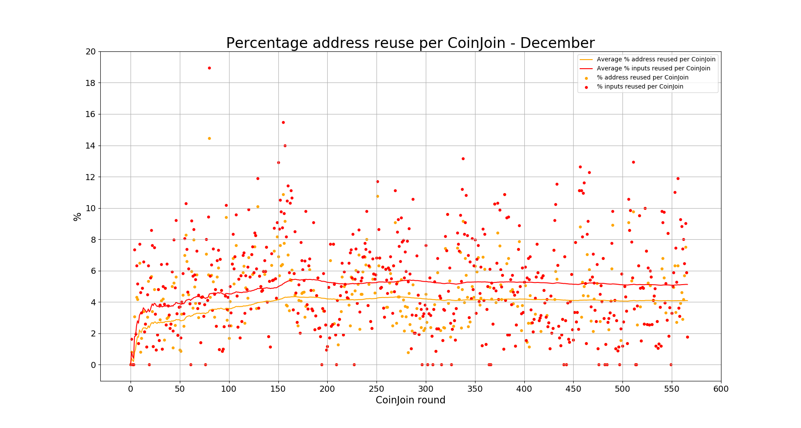

**Last values:**

* Orange line = 4.09
* Red line = 5.12

#### Total percentage address reuse
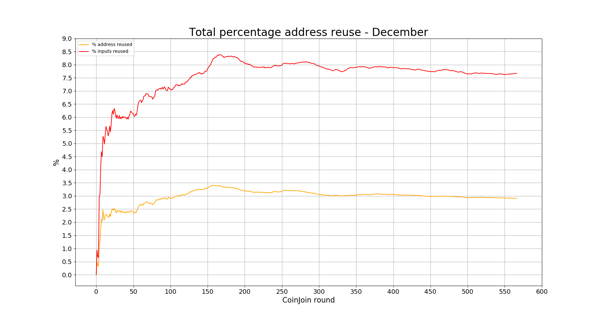

**Last values:**

* Orange line = 2.91
* Red line = 7.66

### EQUAL OUTPUTS

#### Total number equal outputs
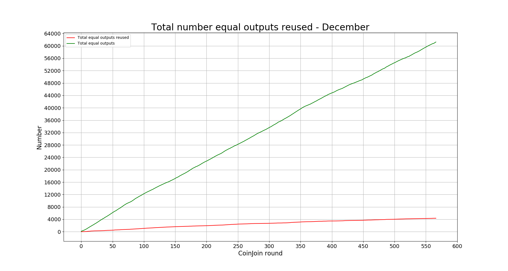

**Last values:**

* Red line = 4353
* Green line = 61239

#### Percentage equal outputs reused per CoinJoin
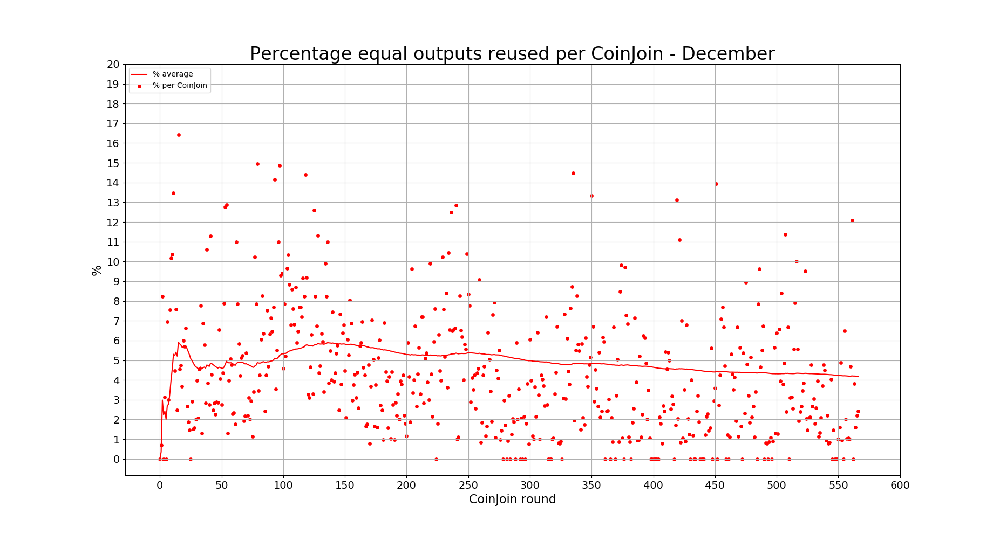

**Last values:**

* Red line = 4.19

#### Total percentage outputs reused
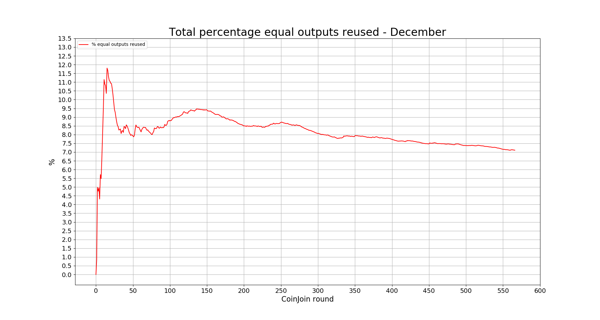

**Last values:**

* Red line = 7.11

### FEES

#### Coordinator fees per CoinJoin
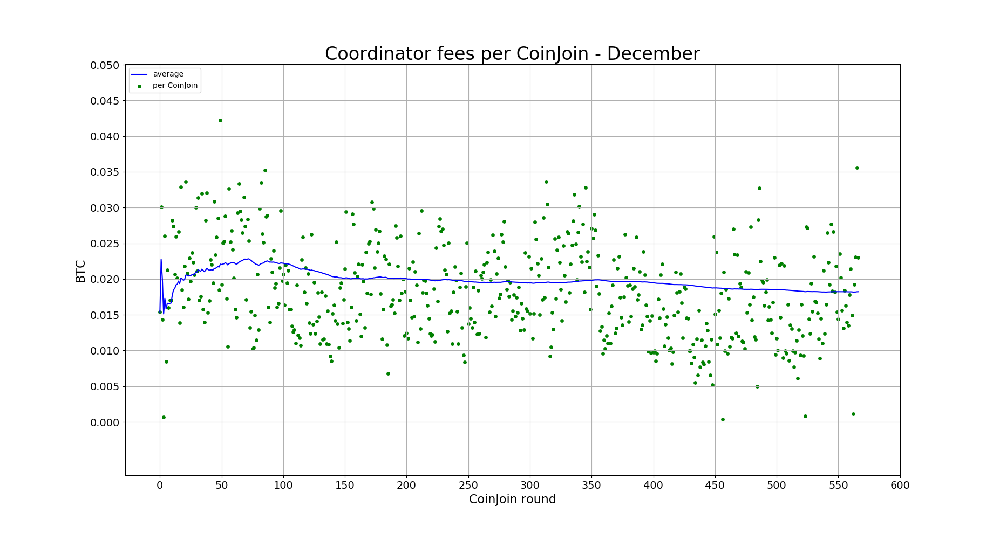

**Last values:**

* Blue line = 0.0182

#### Total coordinator fees
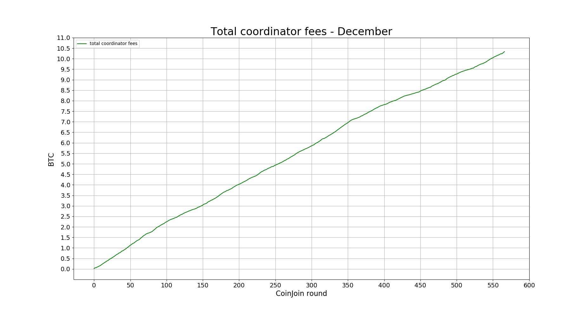

**Last values:**

* Green line = 10.3364

---
### Next data

* [January 2020](https://github.com/PulpCattel/Wasabi_Observatory/blob/master/README.md)

### Previous data

* [November 2019](https://github.com/PulpCattel/Wasabi_Observatory/blob/master/2019/November/README.md)
