A list of statistics of the Wasabi Wallet's trustless CoinJoin implementation.

For a more deep explanation of every stats, including where to find the data and how to calculate them, give a look at the [Don't Trust, Verify](https://github.com/PulpCattel/Wasabi_Observatory/blob/master/Dont_Trust_Verify.md) section. 

---

## November

---

### GENERAL

#### CoinJoin per Day
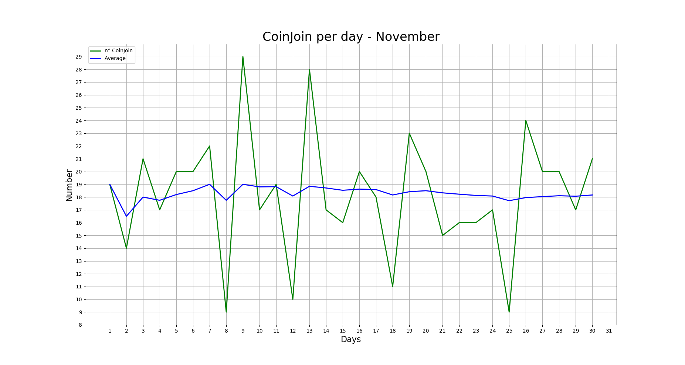

#### Partecipants per CoinJoin
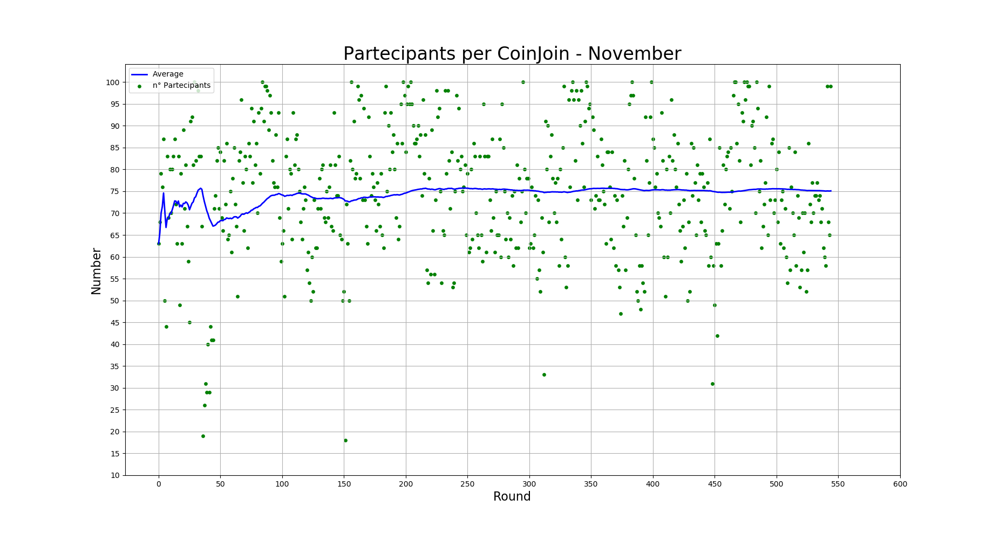

#### Average input size per CoinJoin
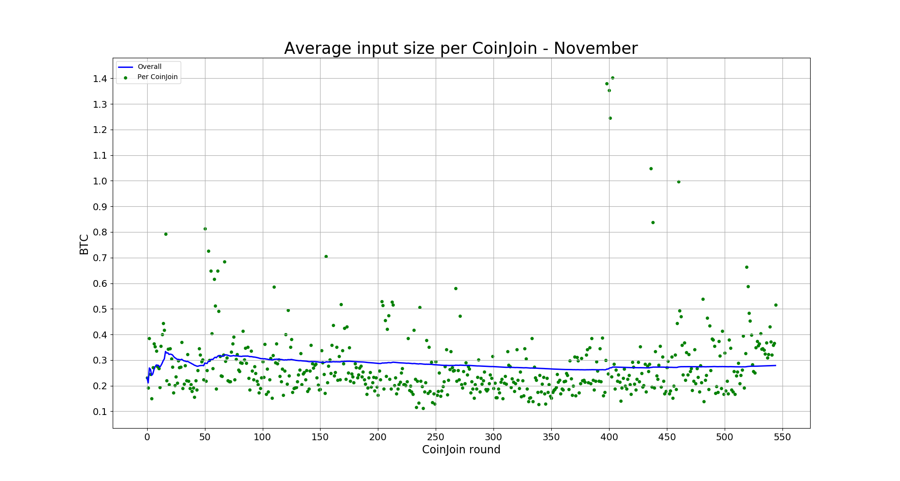

#### Total volume
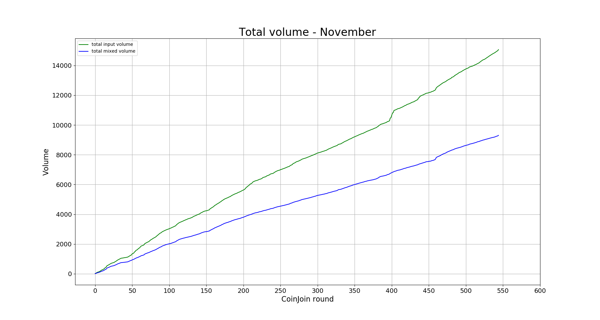

### INPUTS

#### Total number addresses/inputs

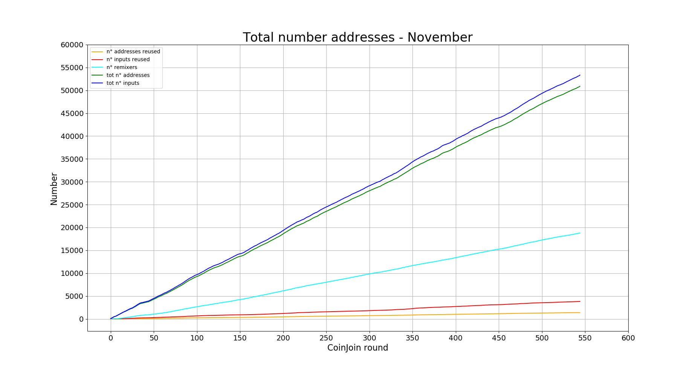

#### Percentage remixers per CoinJoin
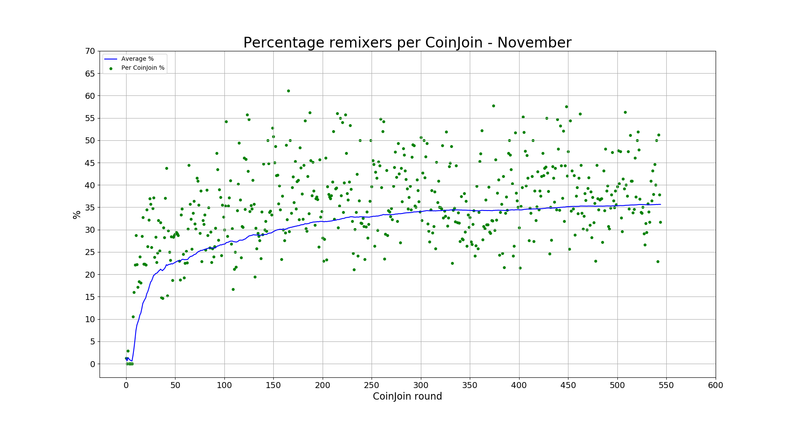

#### Total percentage remixers
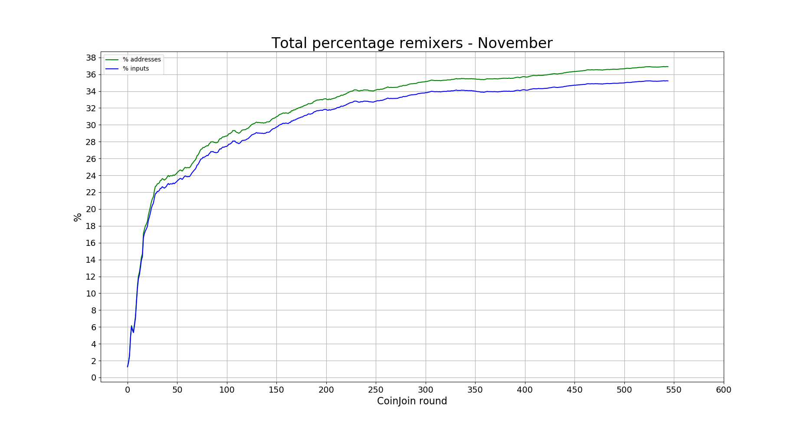

#### Percentage address reuse per CoinJoin
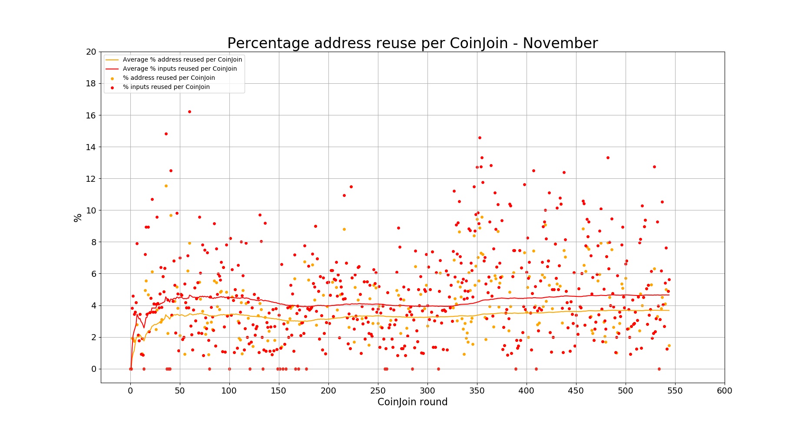

#### Total percentage address reuse
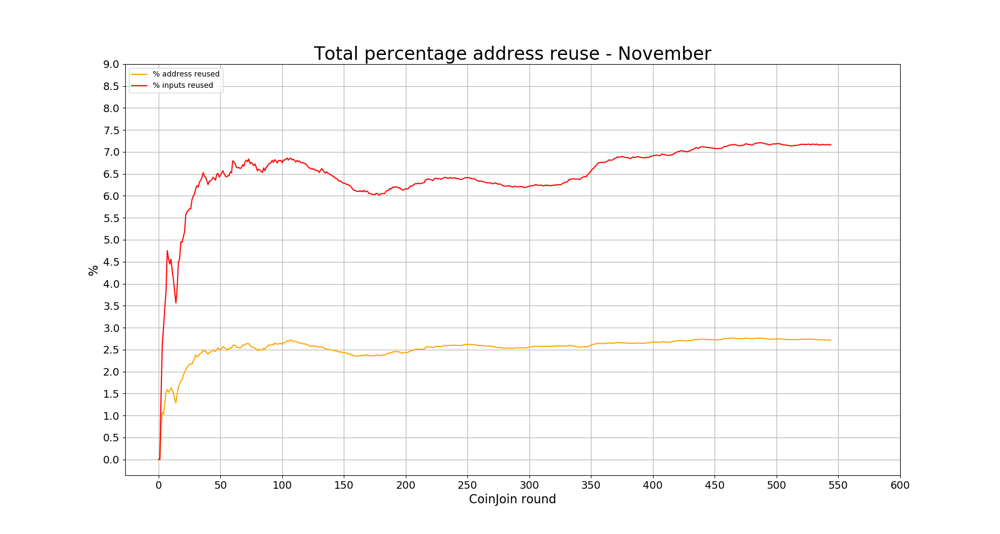

### EQUAL OUTPUTS

#### Total number equal outputs
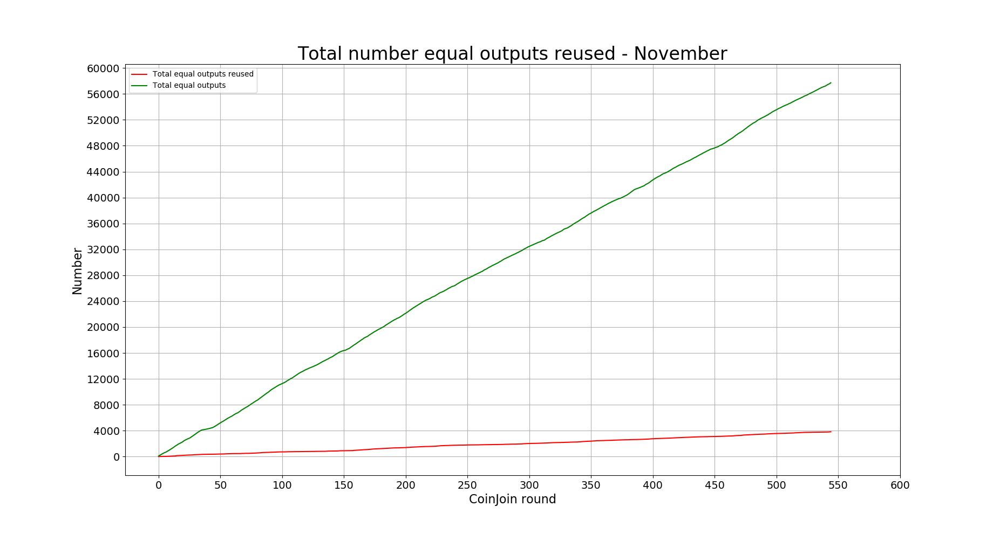

#### Percentage equal outputs reused per CoinJoin
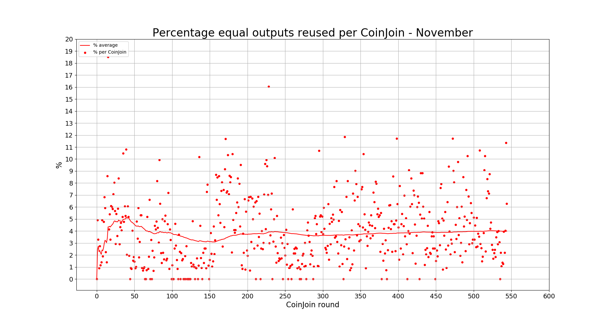

#### Total percentage outputs reused
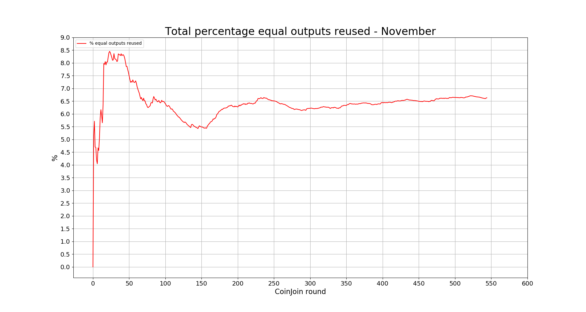

### FEES

#### Coordinator fees per CoinJoin
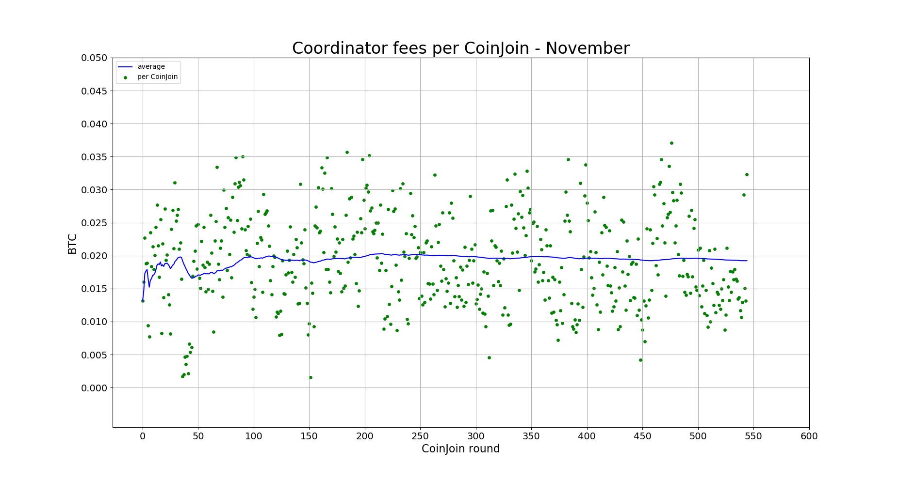

#### Total coordinator fees
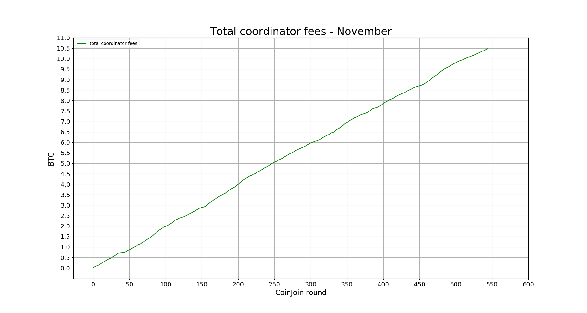
