A list of statistics of the Wasabi Wallet's trustless CoinJoin implementation.

For a more deep explanation of every stats, including how to calculate them and where to find them, give a look at the [Don't Trust, Verify](/Dont_Trust_Verify.md) section.

For stats about the previous months, look [here](/months_list.md).

---

## April - from block 623837 to 628349
**1039 CoinJoin round**

---

### GENERAL

#### CoinJoin per Day
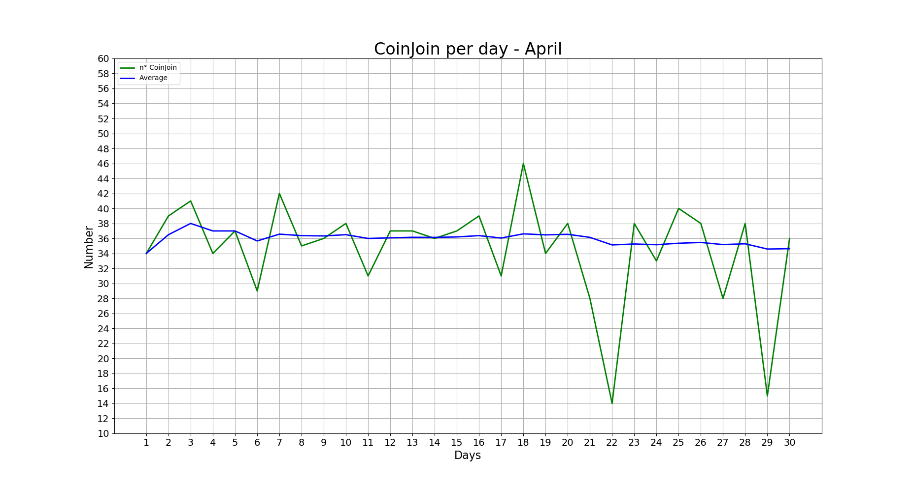

**Last values:**

* Blue line = 34.6

#### Partecipants per CoinJoin
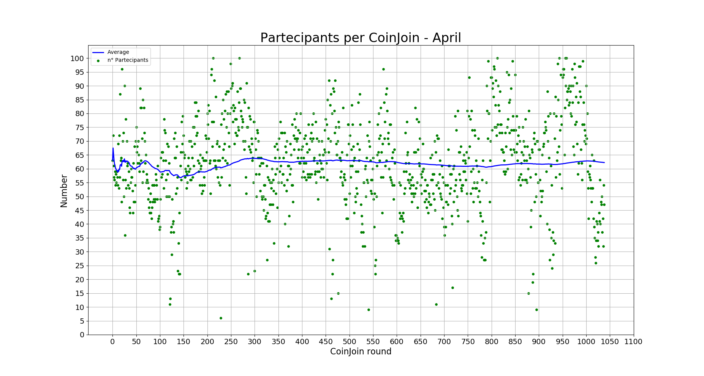

**Last values:**

* Blue line = 62.2

#### Average input size per CoinJoin
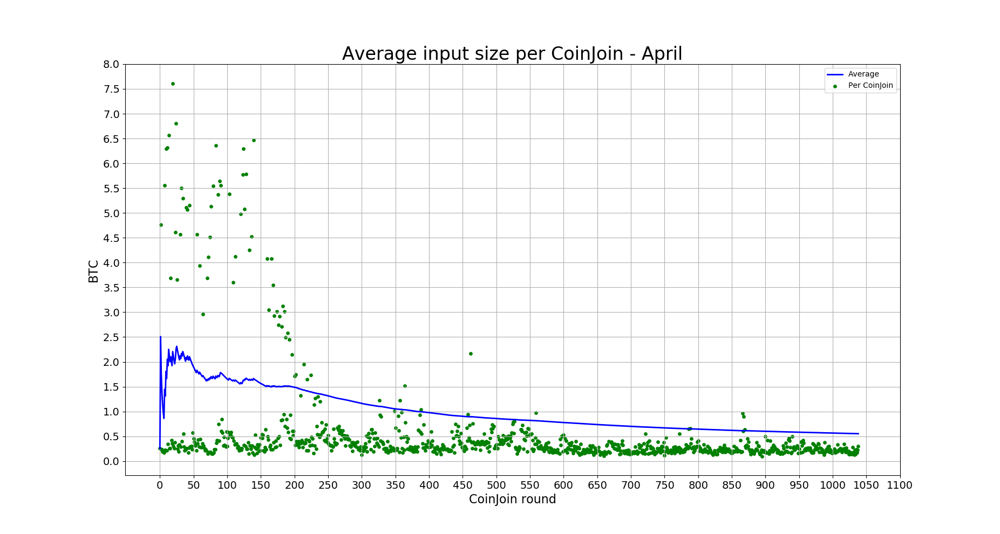

**Last values:**

* Blue line = 0.55

#### Total volume
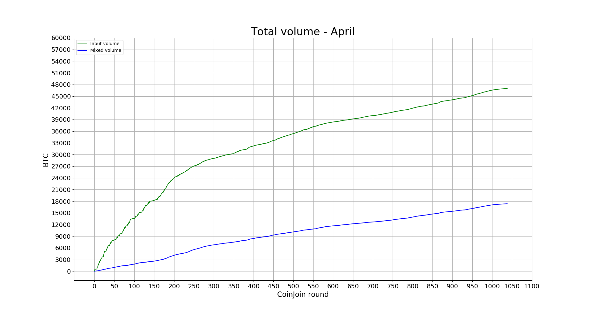

**Last values:**

* Green line = 47006
* Blue line = 17356

### INPUTS

#### Total number addresses/inputs

**Last values:**

* Orange line = 2218
* Red line = 5700
* Light blue line = 31022
* Green line = 82189
* Blue line = 85671

#### Percentage remixers per CoinJoin
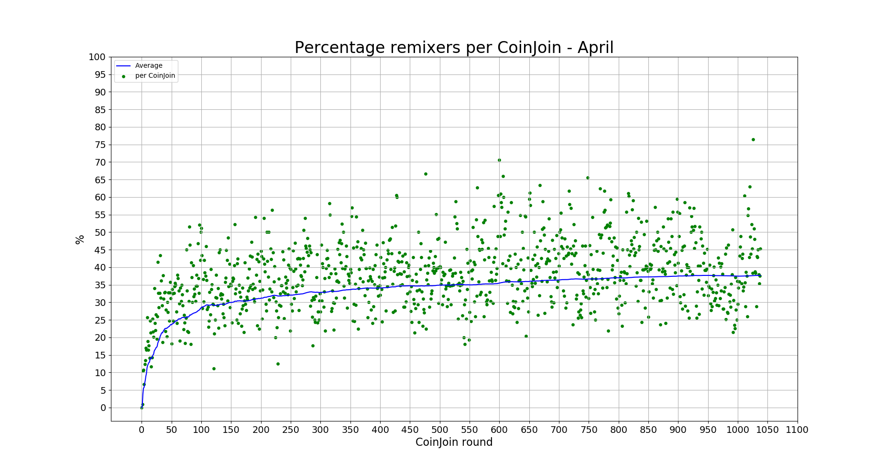

**Last values:**

* Blue line = 37.6

#### Total percentage remixers
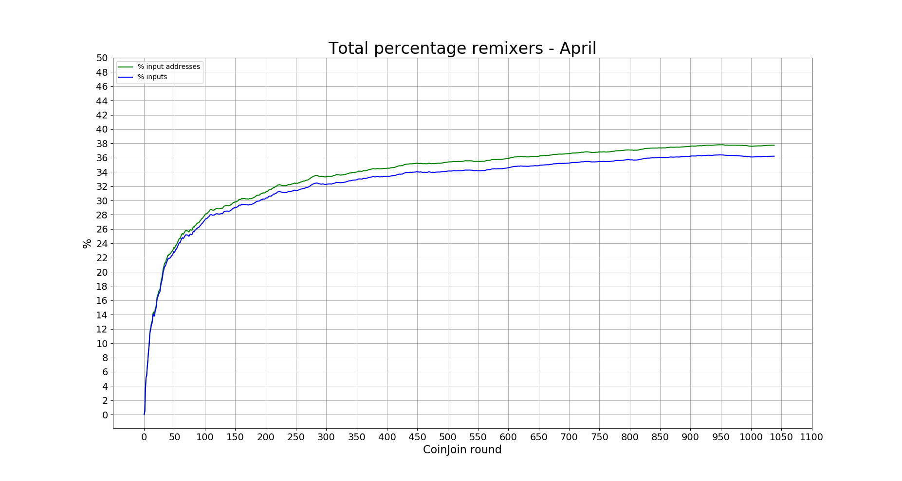

**Last values:**

* Green line = 37.7
* Blue line = 36.2

#### Percentage address reuse per CoinJoin
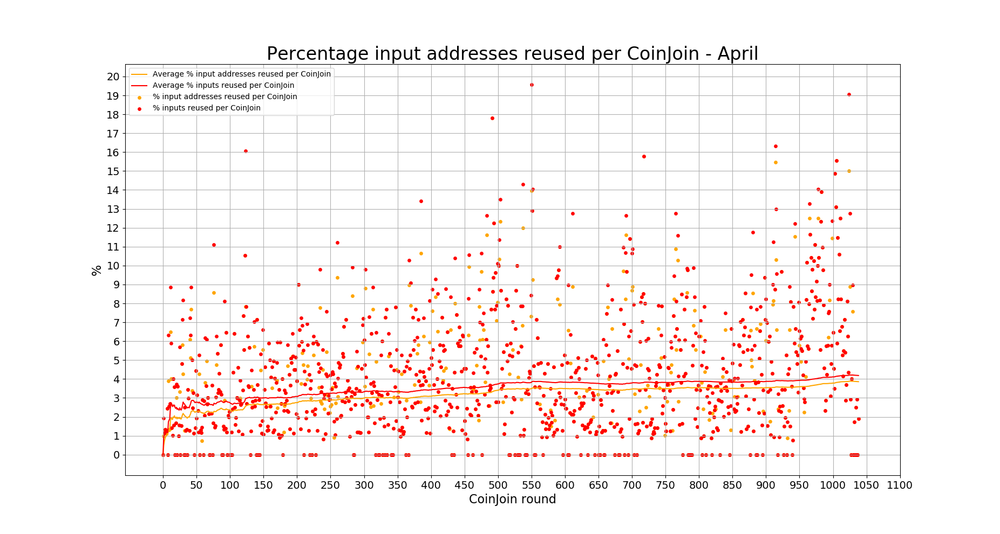

**Last values:**

* Orange line = 3.86
* Red line = 4.18

#### Total percentage address reuse
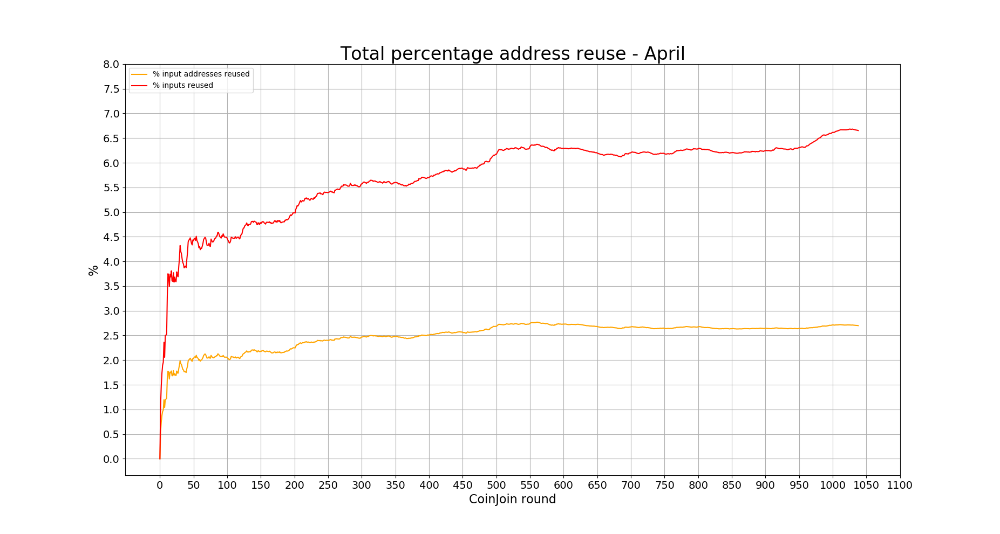

**Last values:**

* Orange line = 2.7
* Red line = 6.65

### EQUAL OUTPUTS

#### Total number equal outputs
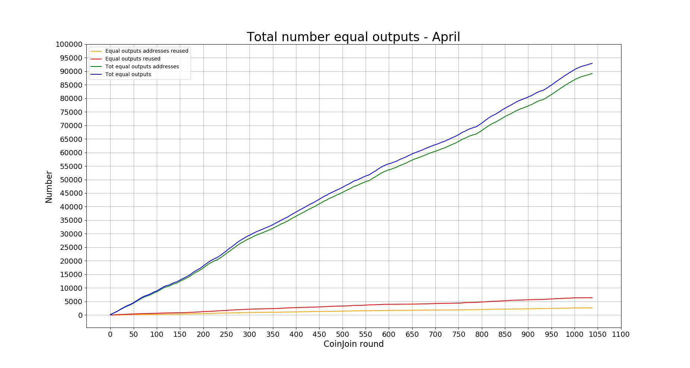

**Last values:**

* Orange line = 2601
* Red line = 6375
* Green line = 89184
* Blue line = 92958

#### Percentage equal outputs reused per CoinJoin
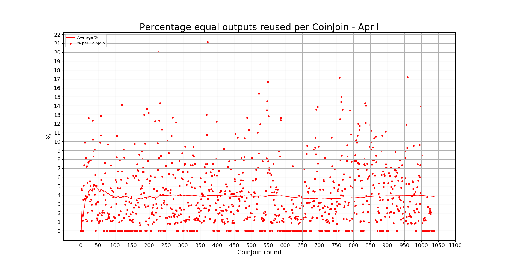

**Last values:**

* Red line = 3.84

#### Total percentage outputs reused
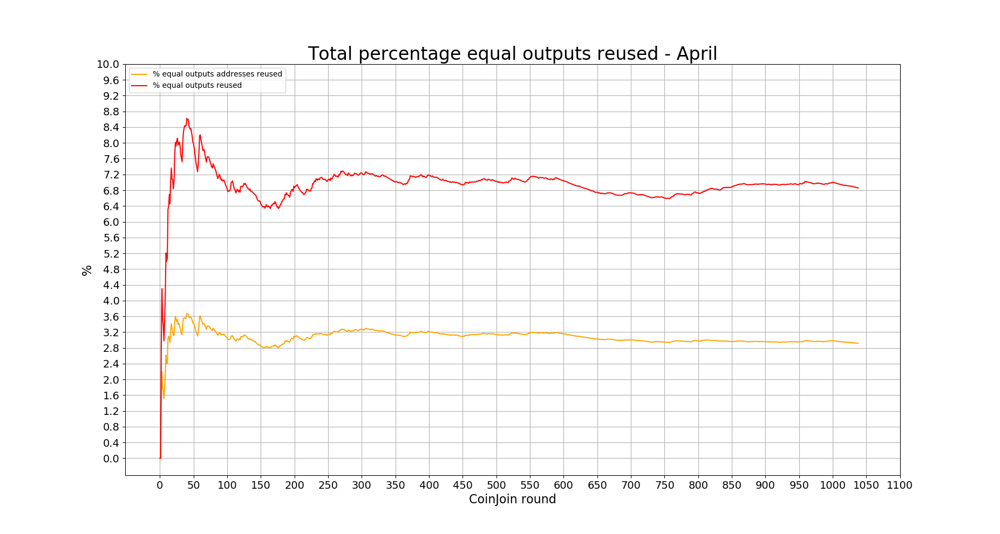

**Last values:**

* Orange line = 2.91
* Red line = 6.85

---

### Next data

* [May 2020](/README.md)

### Previous data

* [March 2020](/2020/March/README.md)
