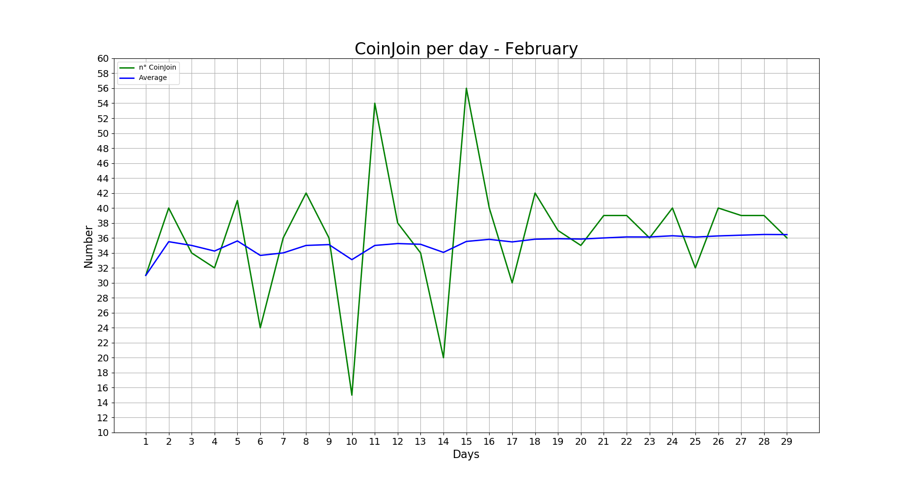
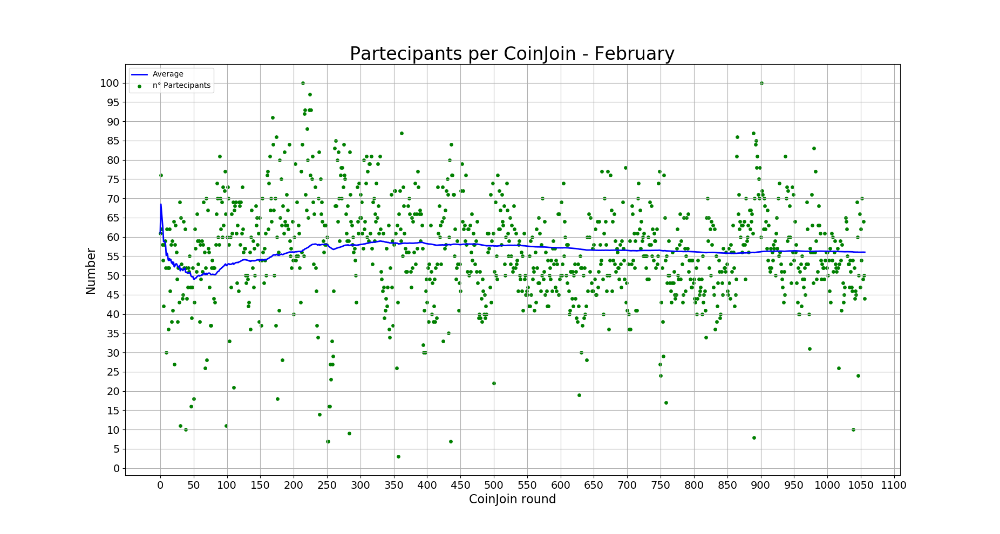
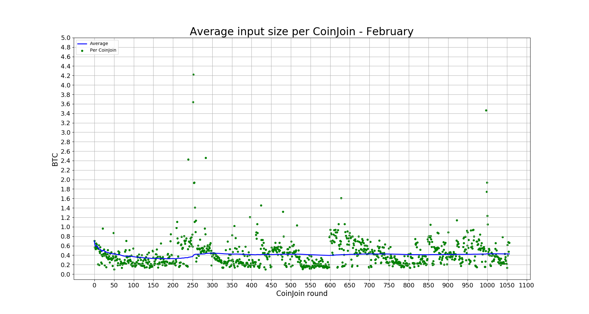
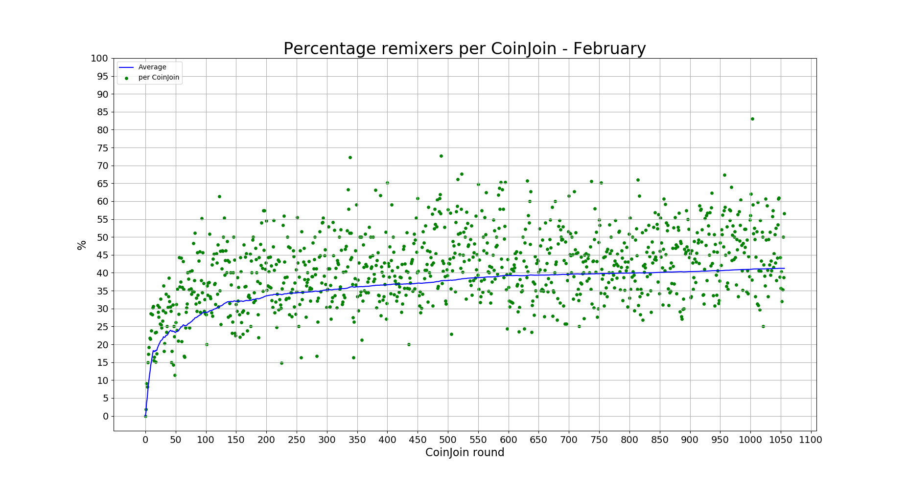
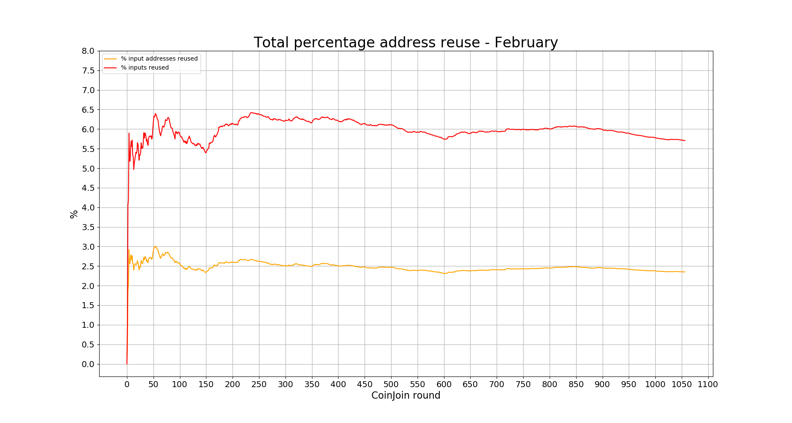
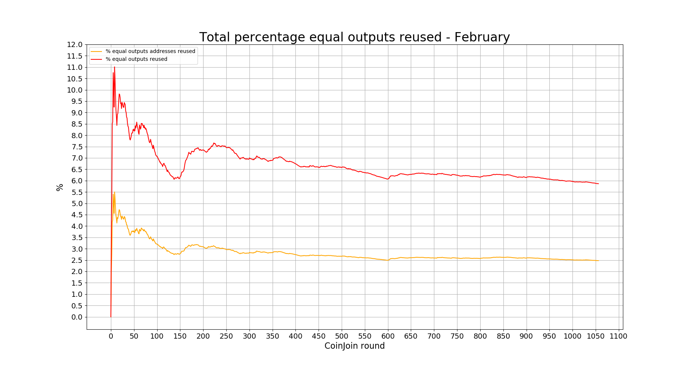

A list of statistics of the Wasabi Wallet's trustless CoinJoin implementation.

For a more deep explanation of every stats, including how to calculate them and where to find them, give a look at the [Don't Trust, Verify](/Dont_Trust_Verify.md) section. 

For stats about the previous months, look [here](/months_list.md).

---

## February - from block 615428 to 619581
**1060 CoinJoin round**

---

### GENERAL

#### CoinJoin per Day

**Last values:**

* Blue line = 36.5

#### Partecipants per CoinJoin

**Last values:**

* Blue line = 56

#### Average input size per CoinJoin

**Last values:**

* Blue line = 0.43

#### Total volume

**Last values:**

* Green line = 31981
* Blue line = 14382

### INPUTS

#### Total number addresses/inputs

**Last values:**

* Orange line = 1739
* Red line = 4374
* Light blue line = 30828
* Green line = 74169
* Blue line = 76804

#### Percentage remixers per CoinJoin

**Last values:**

* Blue line = 41.4

#### Total percentage remixers

**Last values:**

* Green line = 41.5
* Blue line = 40.1

#### Percentage address reuse per CoinJoin

**Last values:**

* Orange line = 3.2
* Red line = 3.6

#### Total percentage address reuse

**Last values:**

* Orange line = 2.3
* Red line = 5.7

### EQUAL OUTPUTS

#### Total number equal outputs

**Last values:**

* Orange line = 1948
* Red line = 4780
* Green line = 78714
* Blue line = 81546

#### Percentage equal outputs reused per CoinJoin

**Last values:**

* Red line = 3.3

#### Total percentage outputs reused

**Last values:**

* Orange line = 2.5
* Red line = 5.9

---

### Next data

* [March 2020](/2020/March/README.md)

### Previous data

* [January 2020](/2020/January/README.md)
