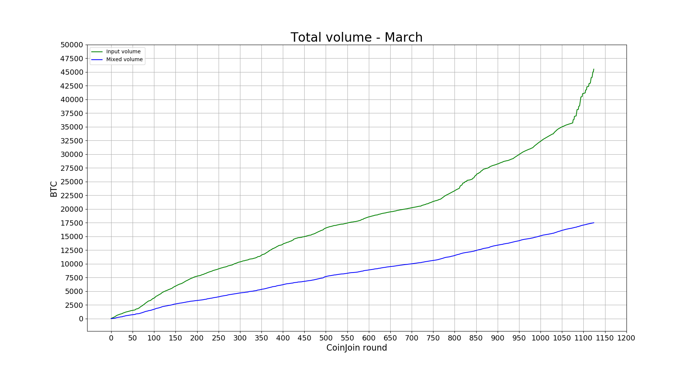
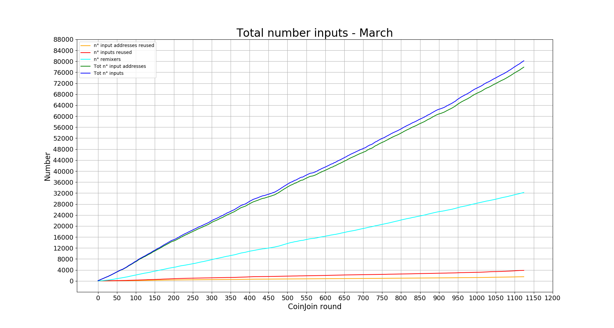

A list of statistics of the Wasabi Wallet's trustless CoinJoin implementation.

For a more deep explanation of every stats, including how to calculate them and where to find them, give a look at the [Don't Trust, Verify](/Dont_Trust_Verify.md) section.

For stats about the previous months, look [here](/months_list.md).

---

## March - from block 619582 to 623836
**1125 CoinJoin round**

---

### GENERAL

#### [CoinJoin per Day](Dont_Trust_Verify.md#coinjoin-per-day)

**Last values:**

* Blue line = 36.3

#### [Partecipants per CoinJoin](Dont_Trust_Verify.md#partecipants-per-coinjoin)

**Last values:**

* Blue line = 55.6

#### [Average input size per CoinJoin](Dont_Trust_Verify.md#average-input-size-per-coinjoin)

**Last values:**

* Blue line = 0.54

#### [Total volume](Dont_Trust_Verify.md#total-volume)

**Last values:**

* Green line = 45532
* Blue line = 17503

### INPUTS

#### [Total number addresses/inputs](Dont_Trust_Verify.md#total-number-of-addresses)

**Last values:**

* Orange line = 1519
* Red line = 3835
* Light blue line = 32211
* Green line = 77883
* Blue line = 80199

#### [Percentage remixers per CoinJoin](Dont_Trust_Verify.md#percentage-remixers-per-coinjoin)

**Last values:**

* Blue line = 41.5

#### [Total percentage remixers](Dont_Trust_Verify.md#total-percentage-remixers)

**Last values:**

* Green line = 41.3
* Blue line = 40.1

#### [Percentage address reuse per CoinJoin](Dont_Trust_Verify.md#percentage-address-reuse-per-coinjoin)

**Last values:**

* Orange line = 2.65
* Red line = 2.96

#### [Total percentage address reuse](Dont_Trust_Verify.md#total-percentage-address-reuse)

**Last values:**

* Orange line = 1.95
* Red line = 4.8

### EQUAL OUTPUTS

#### [Total number equal outputs](Dont_Trust_Verify.md#total-number-equal-outputs)

**Last values:**

* Orange line = 1969
* Red line = 4870
* Green line = 85742
* Blue line = 88643

#### [Percentage equal outputs reused per CoinJoin](Dont_Trust_Verify.md#percentage-equal-outputs-reused-per-coinjoin)

**Last values:**

* Red line = 3.1

#### [Total percentage outputs reused](Dont_Trust_Verify.md#total-percentage-equal-outputs-reused)

**Last values:**

* Orange line = 2.3
* Red line = 5.5

---
### Next data

* [April 2020](/README.md)

### Previous data

* [February 2020](/2020/February/README.md)
