# Wasabi Observatory

[(image source)](https://en.wikipedia.org/wiki/Sphinx_Observatory)

---

**The code used for this Observatory has been repurposed in a new, more general, [repository](https://github.com/PulpCattel/Observatory).  
[Here](https://github.com/PulpCattel/Observatory/blob/master/examples/Wasabi_Observatory.ipynb) you can find the new Wasabi stats updated each month.**

---

A list of statistics of the Wasabi Wallet's trustless CoinJoin implementation.

For a more deep explanation of every stats, including how to calculate them and where to find them, give a look at the [Don't Trust, Verify](Dont_Trust_Verify.md) section.

For stats about the previous months, look [here](months_list.md).

### About Wasabi

* *Site*: https://www.wasabiwallet.io/
* *Onion site*: http://wasabiukrxmkdgve5kynjztuovbg43uxcbcxn6y2okcrsg7gb6jdmbad.onion
* *Documentation*: https://docs.wasabiwallet.io/
* *GitHub*: https://github.com/zkSNACKs/WalletWasabi
* *Research Club*: https://github.com/zkSNACKs/WasabiResearchClub

[nopara73](https://github.com/nopara73), lead developer of Wasabi, also mantains a repository with statistics about CoinJoin activity, give it a look: 

https://github.com/nopara73/Dumplings

---

## May - from block 628350 to 632541 (**HAPPY HALVING!**)
**1145 CoinJoin round**

---

### GENERAL

#### [CoinJoin per Day](Dont_Trust_Verify.md#coinjoin-per-day)
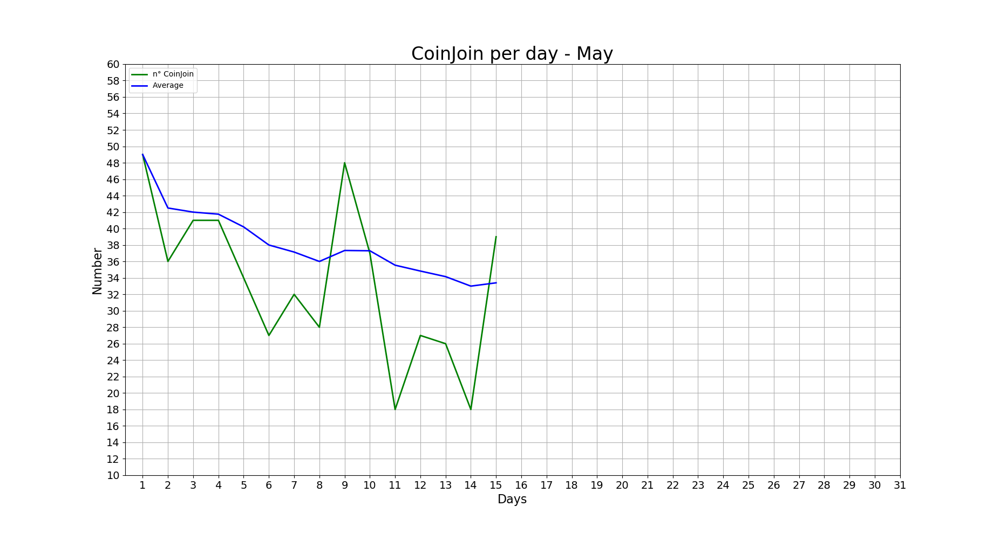

**Last values:**

* Blue line = 36.9

#### [Partecipants per CoinJoin](Dont_Trust_Verify.md#partecipants-per-coinjoin)
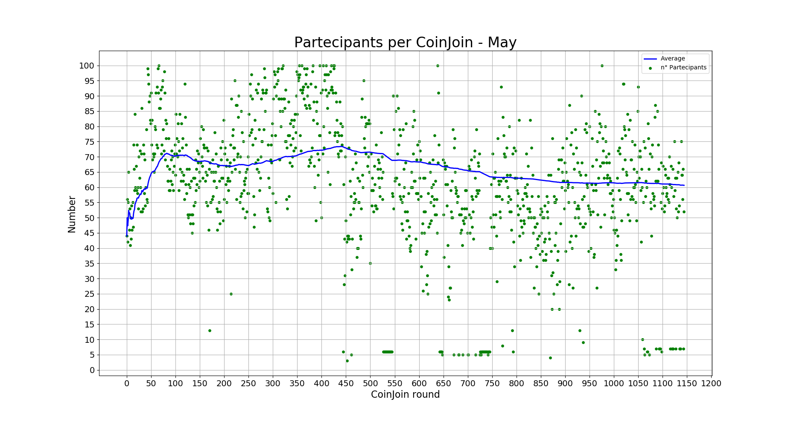

**Last values:**

* Blue line = 60.6

#### [Average input size per CoinJoin](Dont_Trust_Verify.md#average-input-size-per-coinjoin)
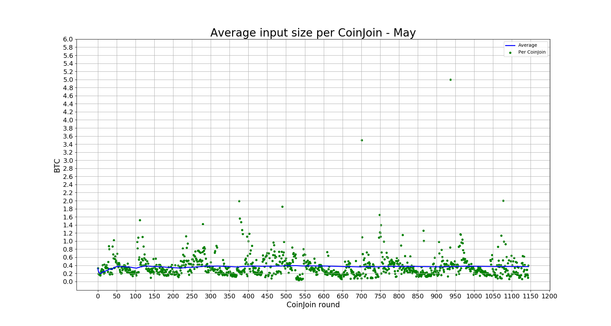

**Last values:**

* Blue line = 0.36

#### [Total volume](Dont_Trust_Verify.md#total-volume)
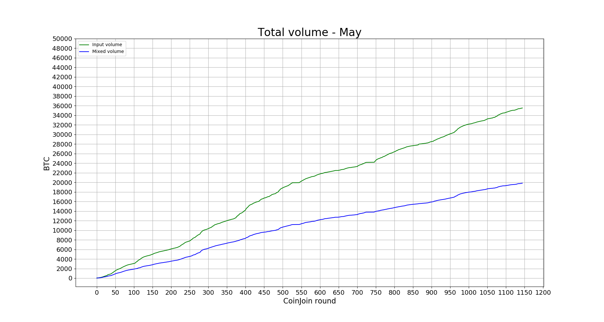

**Last values:**

* Green line = 35522
* Blue line = 19826

### INPUTS

#### [Total number addresses/inputs](Dont_Trust_Verify.md#total-number-of-addresses)
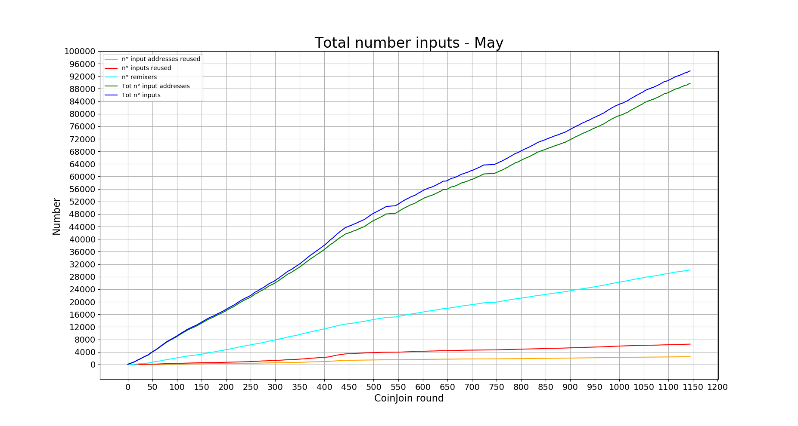

**Last values:**

* Orange line = 2483
* Red line = 6487
* Light blue line = 30163
* Green line = 89684
* Blue line = 93688

#### [Percentage remixers per CoinJoin](Dont_Trust_Verify.md#percentage-remixers-per-coinjoin)
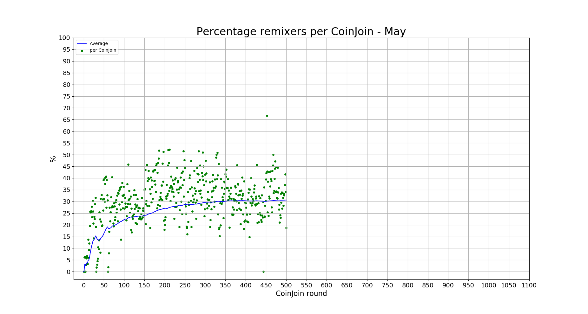

**Last values:**

* Blue line = 34.3

#### [Total percentage remixers](Dont_Trust_Verify.md#total-percentage-remixers)
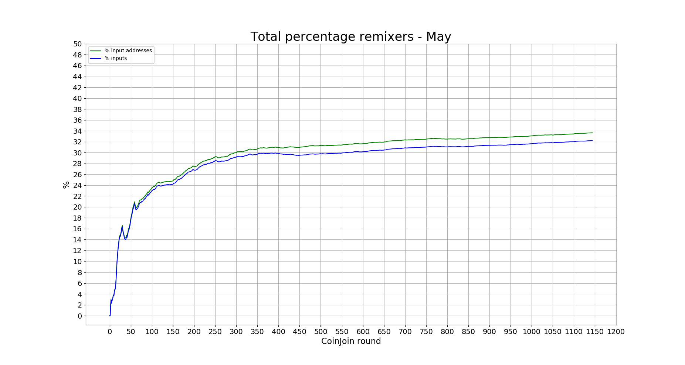

**Last values:**

* Green line = 33.6
* Blue line = 32.2

#### [Percentage address reuse per CoinJoin](Dont_Trust_Verify.md#percentage-address-reuse-per-coinjoin)
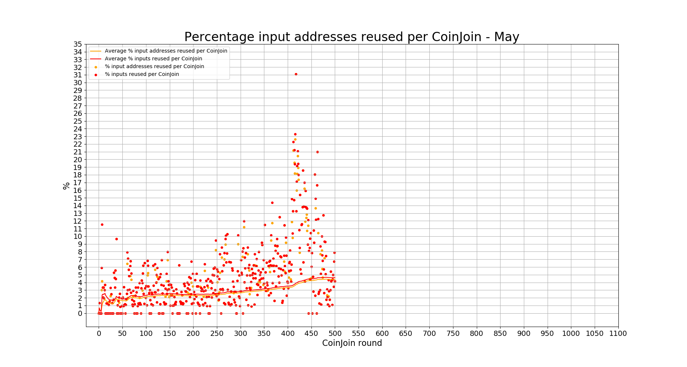

**Last values:**

* Orange line = 3.8
* Red line = 4

#### [Total percentage address reuse](Dont_Trust_Verify.md#total-percentage-address-reuse)
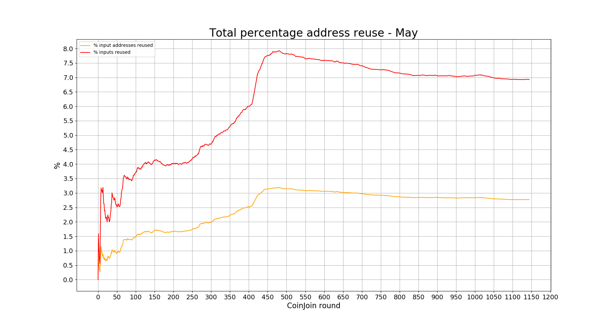

**Last values:**

* Orange line = 2.77
* Red line = 6.92

### EQUAL OUTPUTS

#### [Total number equal outputs](Dont_Trust_Verify.md#total-number-equal-outputs)
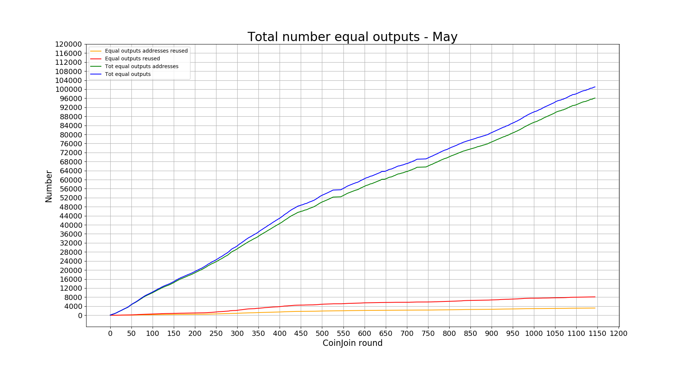

**Last values:**

* Orange line = 3173
* Red line = 8111
* Green line = 96096
* Blue line = 101034

#### [Percentage equal outputs reused per CoinJoin](Dont_Trust_Verify.md#percentage-equal-outputs-reused-per-coinjoin)
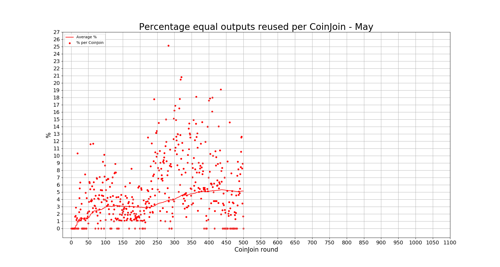

**Last values:**

* Red line = 4.25

#### [Total percentage outputs reused](Dont_Trust_Verify.md#total-percentage-equal-outputs-reused)
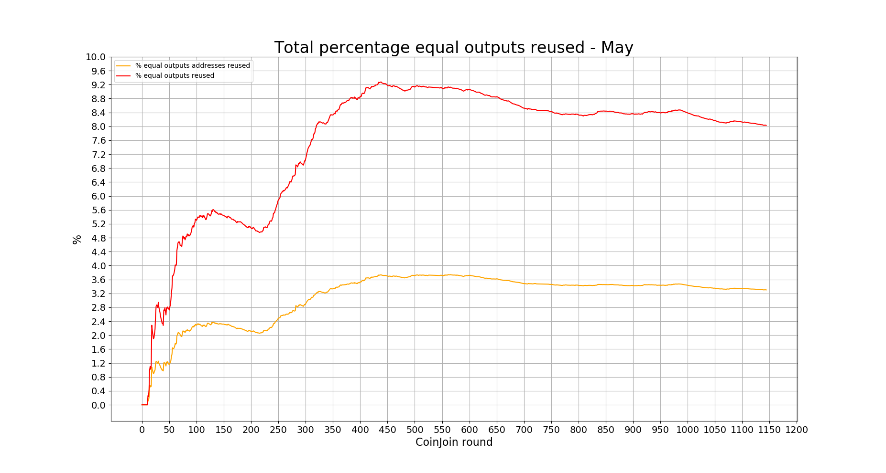

**Last values:**

* Orange line = 3.3
* Red line = 8.03

---

### Previous data

* [April 2020](2020/April/README.md)
