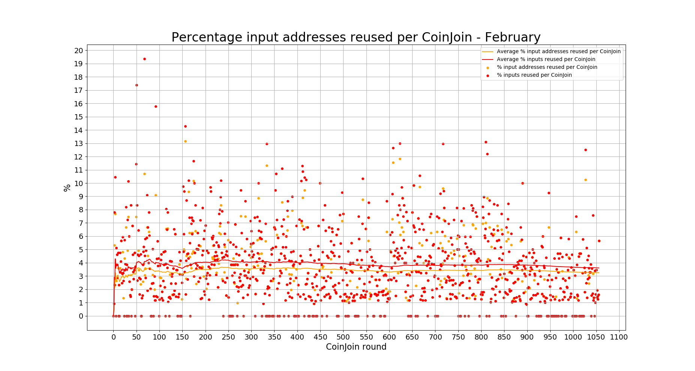
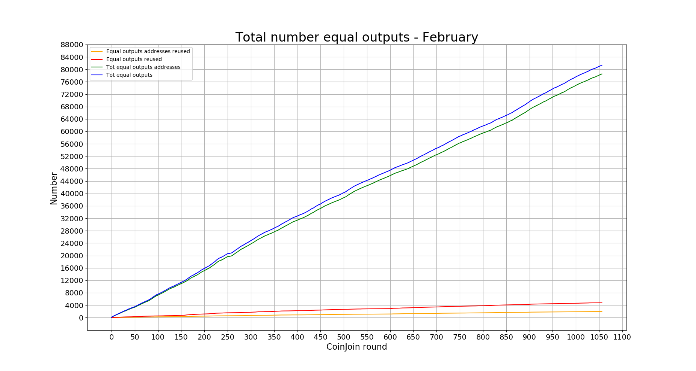
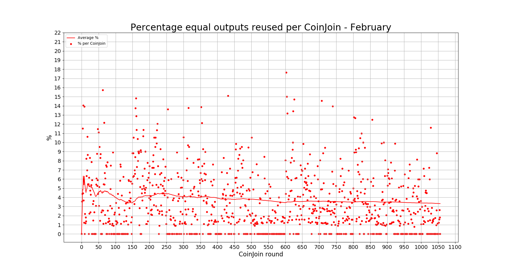

# Wasabi Observatory

[(image source)](https://en.wikipedia.org/wiki/Sphinx_Observatory)

---

A list of statistics of the Wasabi Wallet's trustless CoinJoin implementation.

For a more deep explanation of every stats, including how to calculate them and where to find them, give a look at the [Don't Trust, Verify](Dont_Trust_Verify.md) section. 

For stats about the previous months, look [here](months_list.md).

### About Wasabi

* *Site*: https://www.wasabiwallet.io/ 
* *Onion site*: http://wasabiukrxmkdgve5kynjztuovbg43uxcbcxn6y2okcrsg7gb6jdmbad.onion
* *Documentation*: https://docs.wasabiwallet.io/ 
* *GitHub*: https://github.com/zkSNACKs/WalletWasabi
* *Research Club*: https://github.com/zkSNACKs/WasabiResearchClub

---

## February (ongoing)
**533 CoinJoin round**

---

### GENERAL

#### [CoinJoin per Day](Dont_Trust_Verify.md#coinjoin-per-day)

**Last values:**

* Blue line = 35.53

#### [Partecipants per CoinJoin](Dont_Trust_Verify.md#partecipants-per-coinjoin)

**Last values:**

* Blue line = 57.8

#### [Average input size per CoinJoin](Dont_Trust_Verify.md#average-input-size-per-coinjoin)

**Last values:**

* Blue line = 0.42

#### [Total volume](Dont_Trust_Verify.md#total-volume)

**Last values:**

* Green line = 15189
* Blue line = 7283

### INPUTS

#### [Total number addresses/inputs](Dont_Trust_Verify.md#total-number-of-addresses)

**Last values:**

* Orange line = 884
* Red line = 2272
* Light blue line = 14294
* Green line = 37029
* Blue line = 38417

#### [Percentage remixers per CoinJoin](Dont_Trust_Verify.md#percentage-remixers-per-coinjoin)

**Last values:**

* Blue line = 38.46

#### [Total percentage remixers](Dont_Trust_Verify.md#total-percentage-remixers)

**Last values:**

* Green line = 38.6
* Blue line = 37.2

#### [Percentage address reuse per CoinJoin](Dont_Trust_Verify.md#percentage-address-reuse-per-coinjoin)

**Last values:**

* Orange line = 3.4
* Red line = 3.81

#### [Total percentage address reuse](Dont_Trust_Verify.md#total-percentage-address-reuse)

**Last values:**

* Orange line = 2.39
* Red line = 5.91

### EQUAL OUTPUTS

#### [Total number equal outputs](Dont_Trust_Verify.md#total-number-equal-outputs)

**Last values:**

* Orange line = 1083
* Red line = 2763
* Green line = 41328
* Blue line = 43008

#### [Percentage equal outputs reused per CoinJoin](Dont_Trust_Verify.md#percentage-equal-outputs-reused-per-coinjoin)

**Last values:**

* Red line = 3.7

#### [Total percentage outputs reused](Dont_Trust_Verify.md#total-percentage-equal-outputs-reused)

**Last values:**

* Orange line = 2.62
* Red line = 6.42

---

### Previous data

* [January 2020](2020/January/README.md)
