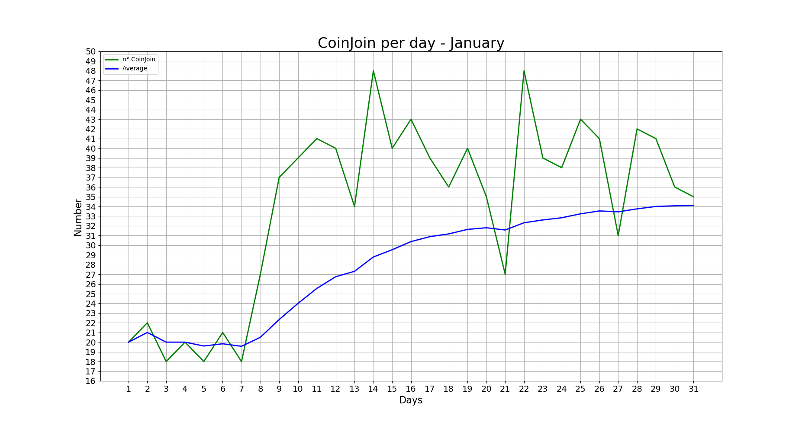
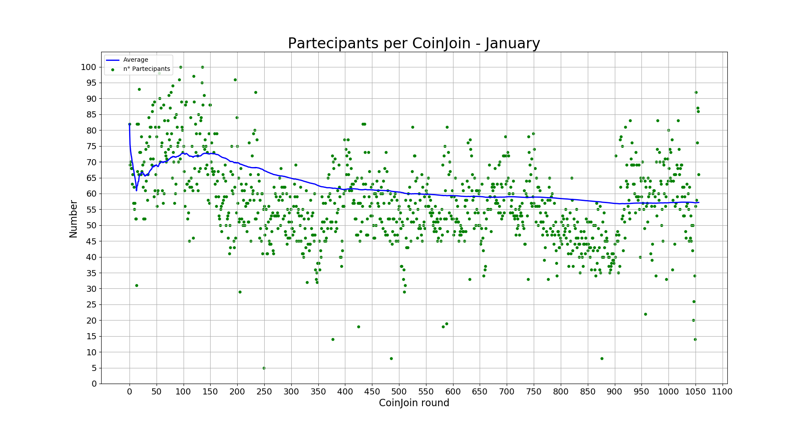
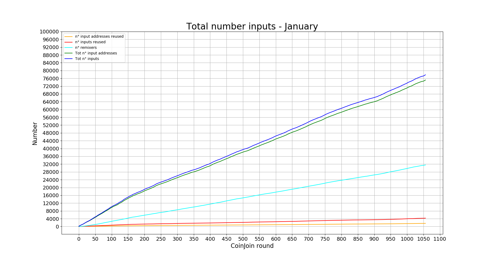
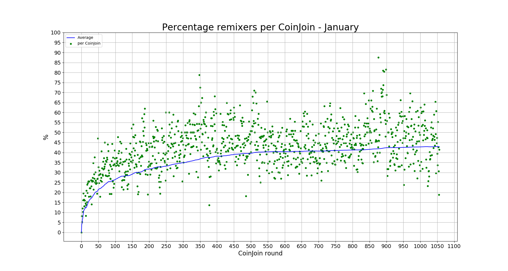
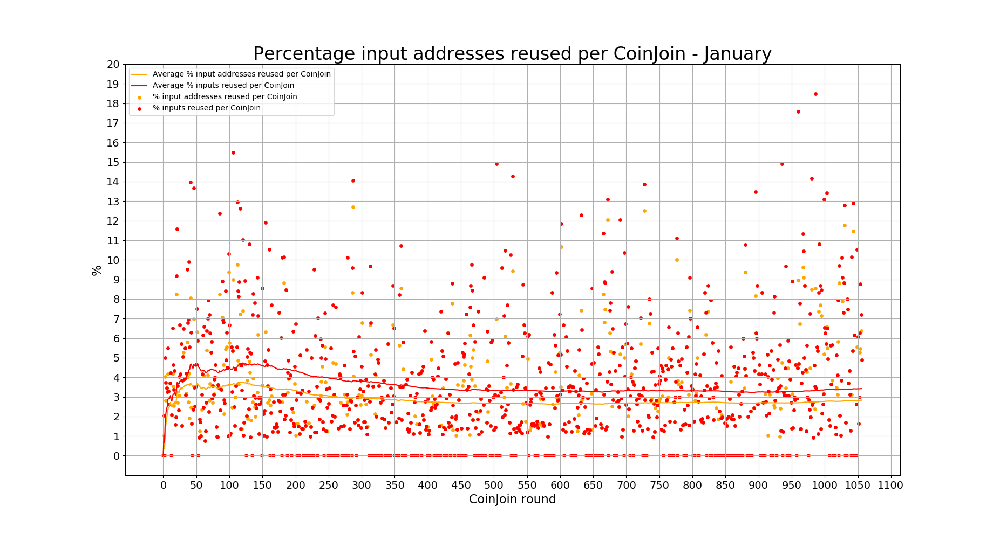

# Wasabi Observatory

[(image source)](https://en.wikipedia.org/wiki/Sphinx_Observatory)

---

A list of statistics of the Wasabi Wallet's trustless CoinJoin implementation.

For a more deep explanation of every stats, including how to calculate them and where to find them, give a look at the [Don't Trust, Verify](Dont_Trust_Verify.md) section. 

For stats about the previous months, look [here](months_list.md).

### About Wasabi

* *Site*: https://www.wasabiwallet.io/ 
* *Onion site*: http://wasabiukrxmkdgve5kynjztuovbg43uxcbcxn6y2okcrsg7gb6jdmbad.onion
* *Documentation*: https://docs.wasabiwallet.io/ 
* *GitHub*: https://github.com/zkSNACKs/WalletWasabi
* *Research Club*: https://github.com/zkSNACKs/WasabiResearchClub

---

## January
**1057 CoinJoin round**

---

### GENERAL

#### [CoinJoin per Day](Dont_Trust_Verify.md#coinjoin-per-day)

**Last values:**

* Blue line = 34.1

> The spike in CoinJoin per day is the result of this test: 
https://www.reddit.com/r/WasabiWallet/comments/elwr05/faster_coinjoins_backend_countdown_timer_reduced/  
You can see effect of this test on other stats too.

#### [Partecipants per CoinJoin](Dont_Trust_Verify.md#partecipants-per-coinjoin)

**Last values:**

* Blue line = 57.17

#### [Average input size per CoinJoin](Dont_Trust_Verify.md#average-input-size-per-coinjoin)

**Last values:**

* Blue line = 0.47

#### [Total volume](Dont_Trust_Verify.md#total-volume)

**Last values:**

* Green line = 36263
* Blue line = 15410

### INPUTS

#### [Total number addresses/inputs](Dont_Trust_Verify.md#total-number-of-addresses)

**Last values:**

* Orange line = 1606
* Red line = 4277
* Light blue line = 31566
* Green line = 75142
* Blue line = 77813

#### [Percentage remixers per CoinJoin](Dont_Trust_Verify.md#percentage-remixers-per-coinjoin)

**Last values:**

* Blue line = 42.9

#### [Total percentage remixers](Dont_Trust_Verify.md#total-percentage-remixers)

**Last values:**

* Green line = 42
* Blue line = 40.56

#### [Percentage address reuse per CoinJoin](Dont_Trust_Verify.md#percentage-address-reuse-per-coinjoin)

**Last values:**

* Orange line = 2.83
* Red line = 3.42

#### [Total percentage address reuse](Dont_Trust_Verify.md#total-percentage-address-reuse)

**Last values:**

* Orange line = 2.14
* Red line = 5.49

### EQUAL OUTPUTS

#### [Total number equal outputs](Dont_Trust_Verify.md#total-number-equal-outputs)

**Last values:**

* Orange line = 1795
* Red line = 4267
* Green line = 81201
* Blue line = 83673

#### [Percentage equal outputs reused per CoinJoin](Dont_Trust_Verify.md#percentage-equal-outputs-reused-per-coinjoin)

**Last values:**

* Red line = 2.8

#### [Total percentage outputs reused](Dont_Trust_Verify.md#total-percentage-equal-outputs-reused)

**Last values:**

* Orange line = 2.21
* Red line = 5.1

---

### Previous data

* [December 2019](2019/December/README.md)
