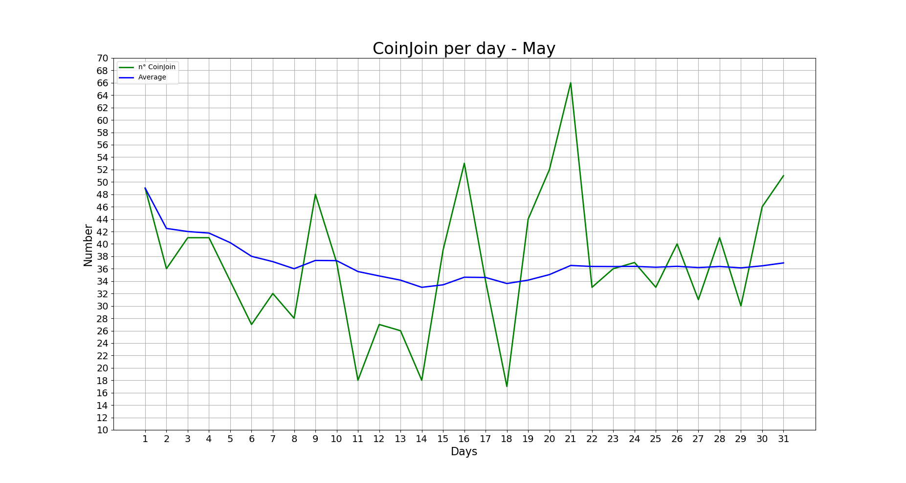
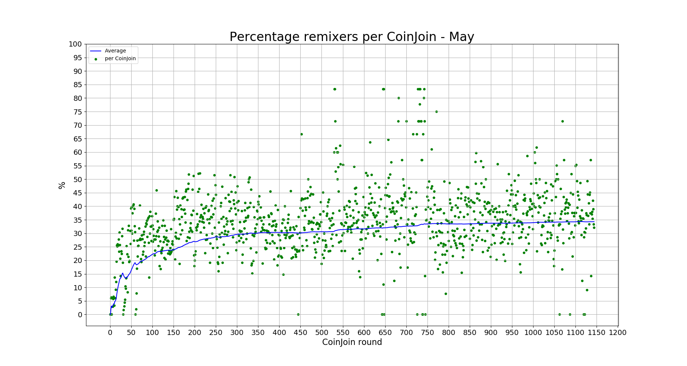
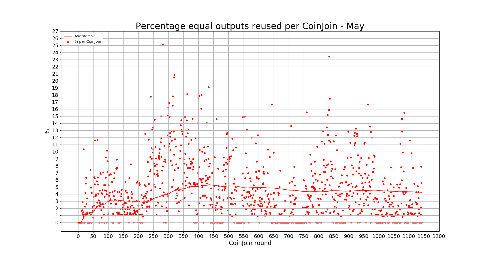

# Wasabi Observatory

[(image source)](https://en.wikipedia.org/wiki/Sphinx_Observatory)

---

A list of statistics of the Wasabi Wallet's trustless CoinJoin implementation.

For a more deep explanation of every stats, including how to calculate them and where to find them, give a look at the [Don't Trust, Verify](Dont_Trust_Verify.md) section.

For stats about the previous months, look [here](months_list.md).

### About Wasabi

* *Site*: https://www.wasabiwallet.io/
* *Onion site*: http://wasabiukrxmkdgve5kynjztuovbg43uxcbcxn6y2okcrsg7gb6jdmbad.onion
* *Documentation*: https://docs.wasabiwallet.io/
* *GitHub*: https://github.com/zkSNACKs/WalletWasabi
* *Research Club*: https://github.com/zkSNACKs/WasabiResearchClub

---

## May - from block 628350 to 630527 (**HAPPY HALVING!**)
**501 CoinJoin round**

---

### GENERAL

#### [CoinJoin per Day](Dont_Trust_Verify.md#coinjoin-per-day)

**Last values:**

* Blue line = 33.4

#### [Partecipants per CoinJoin](Dont_Trust_Verify.md#partecipants-per-coinjoin)

**Last values:**

* Blue line = 71.4

#### [Average input size per CoinJoin](Dont_Trust_Verify.md#average-input-size-per-coinjoin)

**Last values:**

* Blue line = 0.39

#### [Total volume](Dont_Trust_Verify.md#total-volume)

**Last values:**

* Green line = 18853
* Blue line = 10649

### INPUTS

#### [Total number addresses/inputs](Dont_Trust_Verify.md#total-number-of-addresses)

**Last values:**

* Orange line = 1445
* Red line = 3775
* Light blue line = 14364
* Green line = 45902
* Blue line = 48232

#### [Percentage remixers per CoinJoin](Dont_Trust_Verify.md#percentage-remixers-per-coinjoin)

**Last values:**

* Blue line = 30.6

#### [Total percentage remixers](Dont_Trust_Verify.md#total-percentage-remixers)

**Last values:**

* Green line = 31.3
* Blue line = 29.8

#### [Percentage address reuse per CoinJoin](Dont_Trust_Verify.md#percentage-address-reuse-per-coinjoin)

**Last values:**

* Orange line = 4.4
* Red line = 4.6

#### [Total percentage address reuse](Dont_Trust_Verify.md#total-percentage-address-reuse)

**Last values:**

* Orange line = 3.15
* Red line = 7.8

### EQUAL OUTPUTS

#### [Total number equal outputs](Dont_Trust_Verify.md#total-number-equal-outputs)

**Last values:**

* Orange line = 1858
* Red line = 4844
* Green line = 50076
* Blue line = 53062

#### [Percentage equal outputs reused per CoinJoin](Dont_Trust_Verify.md#percentage-equal-outputs-reused-per-coinjoin)

**Last values:**

* Red line = 5.1

#### [Total percentage outputs reused](Dont_Trust_Verify.md#total-percentage-equal-outputs-reused)

**Last values:**

* Orange line = 3.7
* Red line = 9.1

---

### Previous data

* [April 2020](2020/April/README.md)
